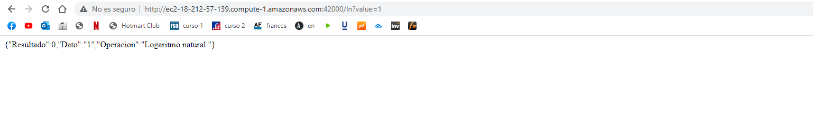
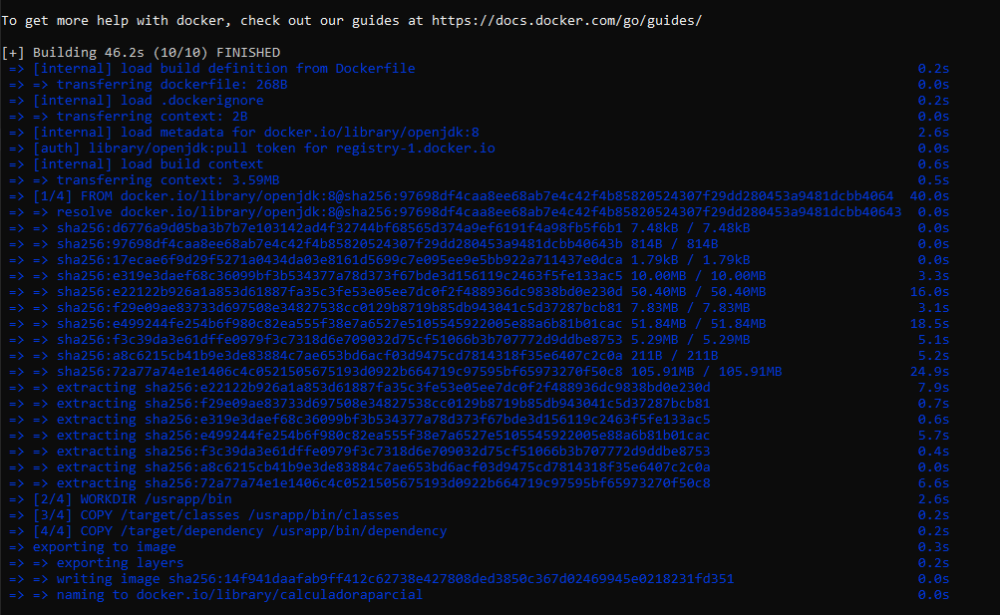
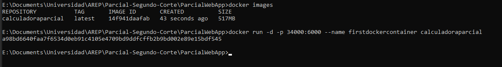
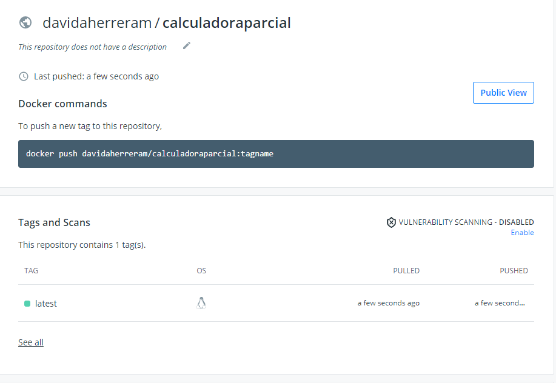

## AREP-2021 Parcial Docker

En esta entrega esta el desarrollo de las funciones cos y ln  y el documento correspondiente para docker

### Prerequisitos

- Maven: Esta es la herramienta encargada de la creacion del proyecto y ayuda a manejar la despedencias del mismo
- Git: Software de control de versiones.
- JDK: Es la herramienta que sirve para desarrollar en java, versiones de este programa desde la 8 en adelante.

### Funcionamiento 

La aplicacion quedo corriendo en una mquina EC2 de AWS y quedo montada la imagen de docker en DockerHub

### Licencia
GNU General Public License v3.0 

### Autor 

#### David Andres Herrera Moya 
